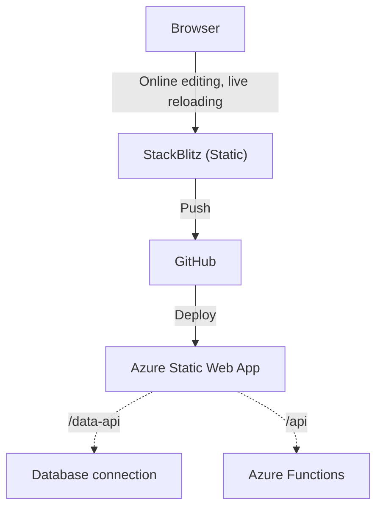

# hcjx

[Edit in StackBlitz next generation editor ⚡️](https://stackblitz.com/~/github.com/patrice-sc/hcjx)

```mermaid
flowchart TD
    A["Browser"]
    B["StackBlitz (Static)"]
    C[GitHub]
    D[Azure Static Web App]
    E[Database connection]
    F[Azure Functions]
    A-->|Online editing, live reloading|B
    B-->|Push|C
    C-->|Deploy|D
    D-.->|/data-api|E
    D-.->|/api|F
```