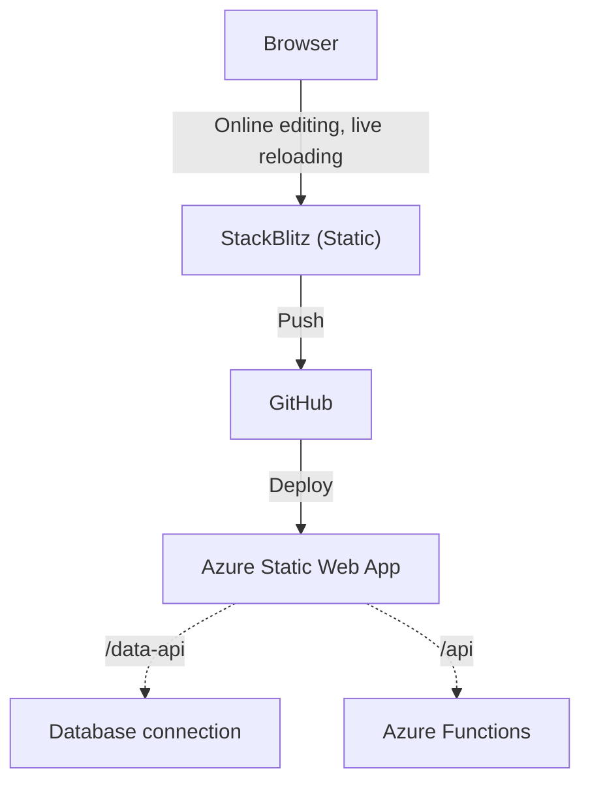

# HTML, CSS and JavaScript experiments

According to <a href="https://2022.stateofjs.com/en-US/libraries/front-end-frameworks/">State of JavaScript 2022</a>, [React](https://react.dev/) and [Angular](https://angular.io/) are the two mostly used front-end frameworks. [htmx](https://htmx.org/) is another option but since quite sometime I wanted to give a fresh start at just [using the plaform](https://eheikes.github.io/use-the-platform-talk/).

This repository is deployed at [proud-mushroom](https://proud-mushroom-0808f4003.5.azurestaticapps.net/).

<!--So for now we are going to :
- edit the code in <a href="htpps://stackblotiz.com/">StackBlitz</a>
- push the code to <a href="https://github.com/">GitHub</a>
- deploy the code to the [proud-mushroom](https://proud-mushroom-0808f4003.5.azurestaticapps.net/) Azure Static Web App
- at some later point I'll likely expect this refresher to the server side
-->

How to setup this workflow

<ul>
<li>Sign in to <a href="https://stackblitz.com/">StackBlitz</a> using your <a href="https::/github.com/">GitHub</a> account</li>
<li>Create a "Static" (HTML/JS/CSS) project</li>
<li>You can now use "Create a repository" to save this project to a new GitHub repository</li>
<li>Sign in to <a href="https://portal.azure.com/">Microsoft Azure</a>
<li>Create an "Azure Static Web App". In the "Deployment details" section, you can select your GitHub repository and branch. Creating the ressource will update this repostiory witn the needed deployment action.</li>
<li>As we don't have any build, add a <a href="https://github.com/patrice-sc/hcjx/commit/e5761587432c865918bb4e68411ed7b547392487">skip_app_build: true</a> line

